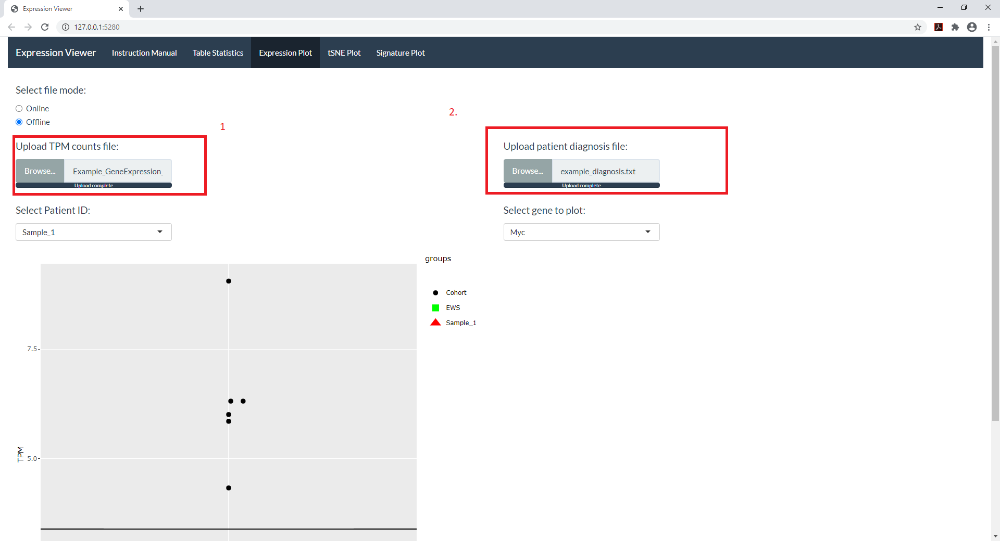
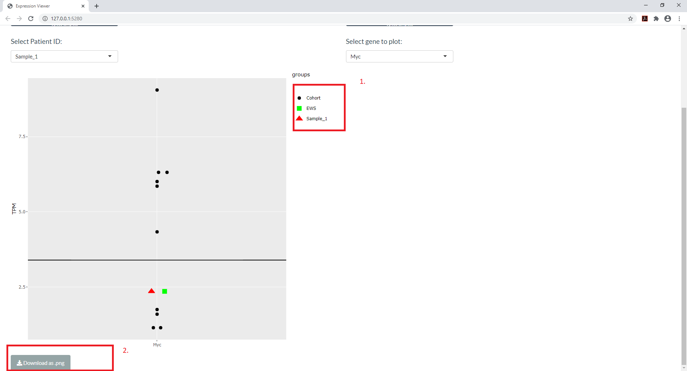

### EXPRESSION PLOTS

```{r include = FALSE}
library(knitr)
knitr::opts_chunk$set(echo = TRUE)
```

The files required to retrieve the expression plots are the raw gene expression TPM counts and a patient diagnosis file. 

```{r out.width = "70%"}

```


The application allows the user to select the patient and gene of interest using a drop down menu. 

The selected patient is depicted in a red triangular shape and green dots represent the expression of the gene from patients that fall in the same histology group. (refer to below image (1))

*The app has the addditional property to able to hover over the dots within the graph to retrieve sample specific meta information.* 


```{r out.width = "70%"}

```

The generated graph can be **saved as a png file** using the download button.(refer to the above image (2))
