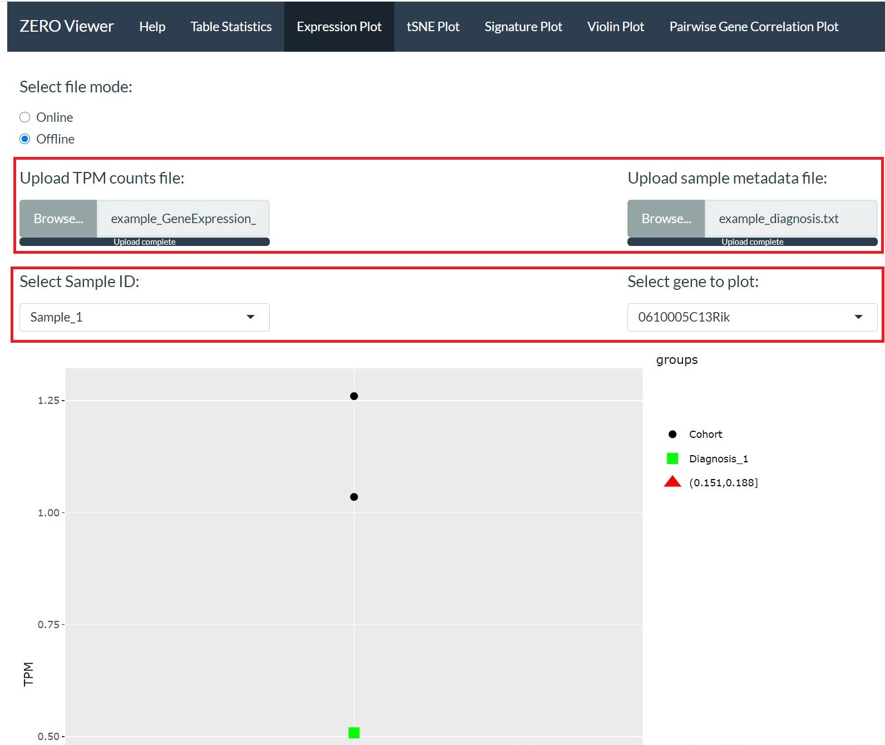
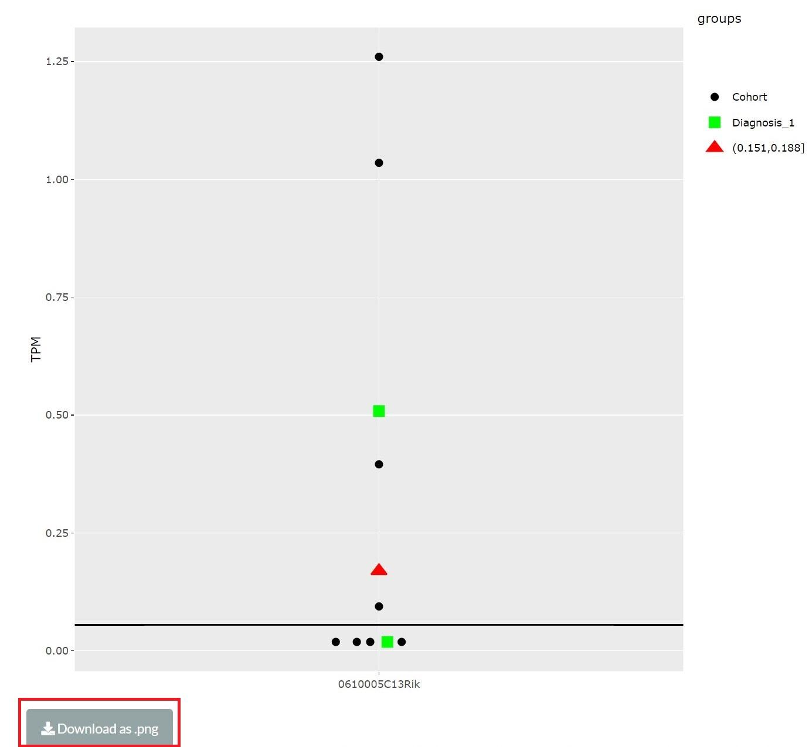

```{r include = FALSE}
library(knitr)
knitr::opts_chunk$set(echo = TRUE)
```

### Expression plot

The expression plot module allows the user to generate a TPM plot for all samples for a single gene. The user will additionally be able to highlight a specific sample within the plot as well as the associated samples within the same group. 

The module requires the user to upload 2 files:

* **1. TPM count table.**

* **2. Sample metadata file.**

```{r out.width = "75%", fig.align='center', echo=FALSE}

```

The expression plot module allows the user to select the sample and gene of interest using the 'Select Sample ID:' and 'Select gene to plot:' drop down lists respectively (see above). 

The selected sample is highlighted as a red triangle while the green dots highlight samples that are part of the same group.

*The interactive plot has the addditional property of hovering over data points to display sample specific meta information.* 

```{r out.width = "75%", fig.align='center', echo=FALSE}

```

Final expression plots can be downloaded using the download button located at the bottom of the page. The downloaded plot will differ slightly from the interactive plot, however, will still represent the same (along with the colourings of the groups and specified sample).
