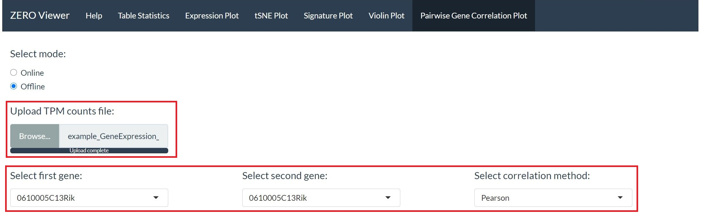

```{r include = FALSE}
library(knitr)
knitr::opts_chunk$set(echo = TRUE)
```

### Pairwise gene correlation

The pairwise gene correlation module requires the user to upload 1 file:

* **1. TPM count table.**

```{r out.width = "75%", fig.align='center', echo=FALSE}

```

Two genes can be selected from the drop down lists (based on the first column of the TPM file). Additionally, different correlation methods (pearson, kendall and spearman) can be selected. 

A plot with log converted TPM values between the two specified genes will be output. The plot will also contain a linear model fitted line. Above the plot will be the relevant correlation coefficient (*r*) and associated p-value (*p*). 

```{r out.width = "75%", fig.align='center', echo=FALSE}
include_graphics("Instruction_images/gene_cor_2.jpg")
```

Downloaded images will have the correlation coefficient and associated p-value printed in the top left of the plot. 