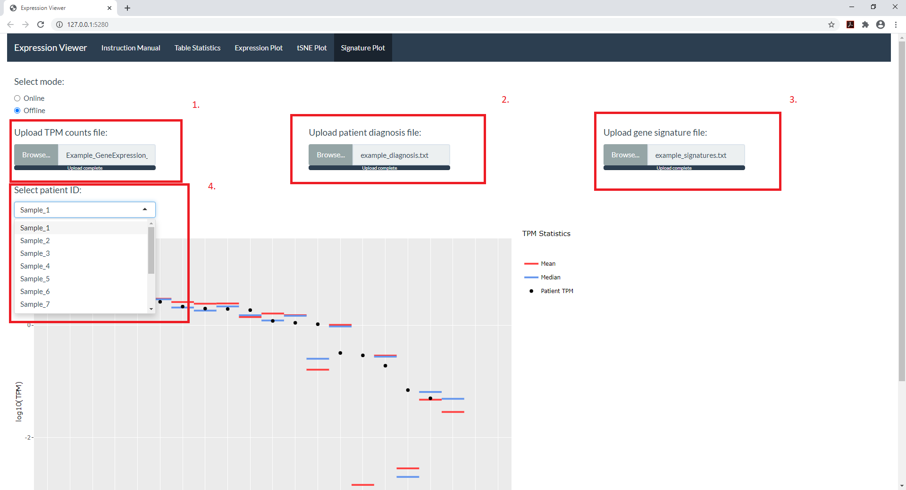

### SIGNATURE PLOT

```{r include = FALSE}
library(knitr)
knitr::opts_chunk$set(echo = TRUE)
```


```{r out.width = "50%", fig.align='center'}

```

The three files required to plot the gene signature expressions are : 

**1. Gene expression TPM counts.**

**2. Patient diagnosis file.**

**3. Text file containing the signature gene sets.** 

```{r}
ex_gene_sig <- read.delim("Example_files/example_signatures.txt", header=T, sep="\t")
ex_gene_sig[1:5,]
```


User define signature files can be created similar to the one provided above. 

Drop down menu is provided to select the interested patient ID (see above image (4.)). 

Resulting plot can be **downloaded** as a png file using the download button at the bottom left corner. 
