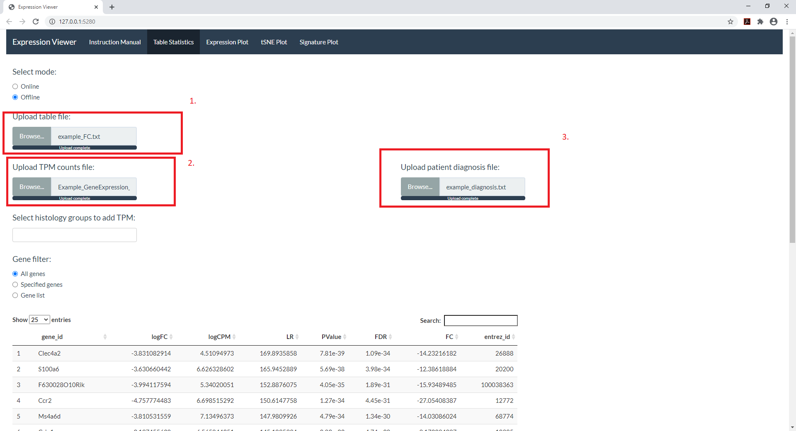
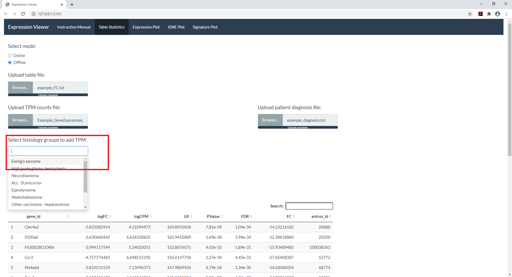
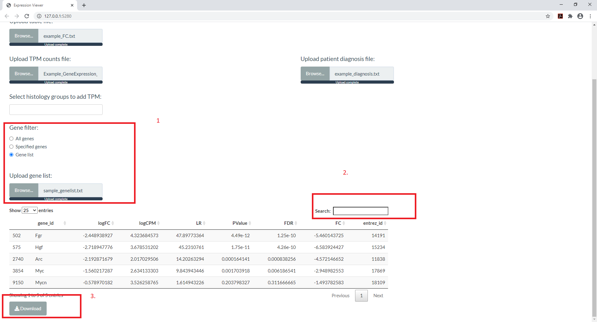

## Table Statistics

```{r include = F}
library(knitr)
```

Table statistics allows you to easily access the the statistical outputs such as Pvalues and Fold change values without having to open any spreadsheets. 

Table statistics essentially requires you to upload 3 files.

```{r out.width = "50%", echo=FALSE}


```

**1. A tab deliminated text file which has the FC values.** 

A table where in the first column has the gene ids and any N number of columns representing the different statistical scores such as Z score, FC value, Pvalue, etc. 

```{r, echo=FALSE }
example <- read.table("Example_files/example_FC.txt", header = T)
example[1:5,]
```


**2. Gene expression counts file.**

Essentially a TPM counts file which has the TPM expression values for the different patient samples.

```{r echo=FALSE }
ex_TPM <- read.table("Example_files/Example_GeneExpression_TPM_Counts.txt", header = T, sep="\t")
ex_TPM[1:4,1:7]
```


**3. A patient diagnosis file.** 

The file should have the following columns : 
-*patient ID* - Patient ID should match the columns of the TPM expression file
-*Diagnosis*
-*final diagnosis*
-*category*. 


```{r echo=FALSE }
ex_patient_diagnosis <- read.delim("Example_files/example_diagnosis.txt", header = T, sep="\t")
ex_patient_diagnosis
```


**Various options provided:**

* One of the features present in the table statistics is to receive specific histology group statistics based on the groups mentioned in the patient diagnosis file. 

The option "Select histology groups to add TPM" provides a drop down menu with all the histologies. Multiple selections are allowed. 

```{r out.width = "50%", echo=FALSE}

```

* Selecting genes 

Retrieval gene specific values can be retrieved using either of the three options : 

  *a. all genes - retrieves all the genes present in the file*

  *b. Specified genes - User can select genes from a down down menu.*

  *c. Gene list - Takes in a text file which has the gene names mentioned.*

```{r out.width = "50%", echo=FALSE}
include_graphics("Instruction_images/select_genes.png")
```


Additionally, there is a search option provided where in the user can perform a keyword search (see below image (2)) . 

```{r out.width = "50%", echo=FALSE}

```

* Download - download the depicted table statistics locally.(refer to above image(3)) 
