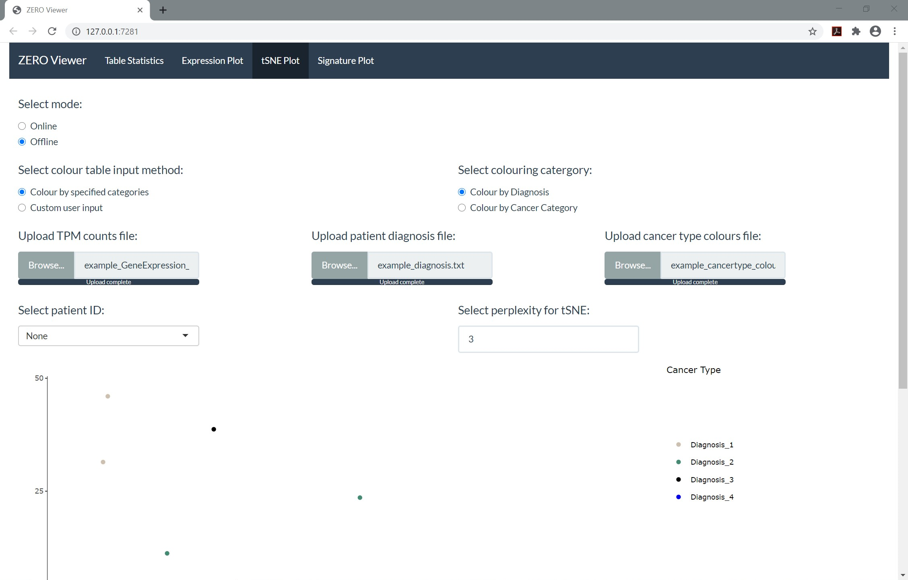
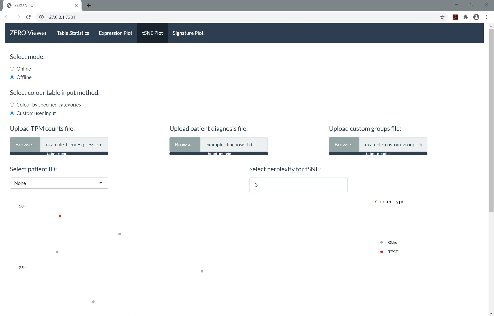
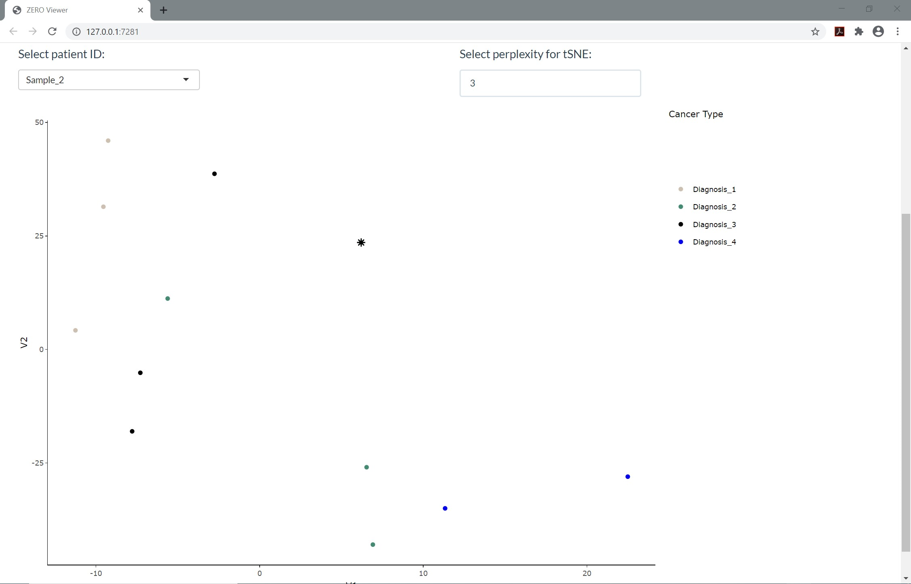

```{r include = FALSE}
library(knitr)
knitr::opts_chunk$set(echo = TRUE)
```
### TSNE PLOT
In order to generate tSNE PLOT, 3 files are required: 
1. Gene expression count table
2. Patient diagnosis file
3. Cancer type colors required for the tsne plot **OR** a custom group file based on sample ID and given groups (currently up to 9 groups). Check out the link to download examples of each of the files. 

Colours can be assigned via two methods. 

**Method 1**

The first method is by using a file containing colours assigned to the Diagnosis or Cancer Category based on the diagnosis file (cancer type colours example). Please note that the headers must be exactly as is shown in the example.

```{r echo=FALSE}
example_cancer_colors <- read.delim("Example_files/example_cancertype_colours.txt", header=T, sep="\t")
example_cancer_colors[1:5,]
```


The 'Colour by specified categories' option under 'Select colour table input method' must be selected for this method to be used. A second option for selecting either the Diagnosis or Cancer Category (based on the columns in the cancer type colours input file) will appear under 'Select colouring category'.

```{r out.width = "50%", echo=FALSE}

```

**Method 2**

The second method is a custom user input with sample IDs and group names can be used (see custom group file example). Please note that the headers must be exactly as is shown in the example.

```{r}
example_custom_colors <- read.delim("Example_files/example_custom_groups_file.txt", header=T, sep="\t")
example_custom_colors
```

The 'Custom user input' option under 'Select colour table input method' must be selected for this method to be used. 

```{r out.width = "50%", echo=FALSE}

```
 
Please be aware that the tSNE plots may take sometime to load. If it does not end up loading after few minutes, please try restarting the application. 

Options: 

The application allows the user to identify the cluster within which a patient fall into by selecting the interested patient using a drop down menu. 

select a patient ID which is highlighted within the group as a star (see example image below).

```{r out.width = "50%", echo=FALSE }

```

Additionally, user can hover over the graph to identify the patient ID, diagnosis and cancer category each of the dot falls into. 

There is also an option to change the perplexity of the tSNE in the case that there are too few samples for the default of 20 or if you wish to increase it beyond 20. 

The generated graph can be downloaded as a png file and saved locally using the download button. 

An error message will initially appear prior to loading the files. This message can be ignored (will be fixed in a future update). Any further error messages that appear will be directly related to an issue with the uploaded files or the specified perplexity of the tSNE.  