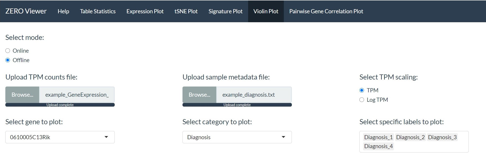
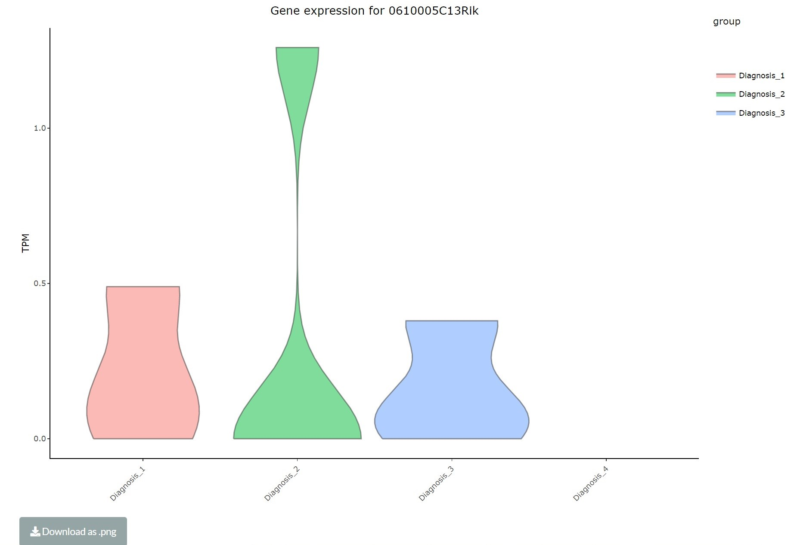

```{r include = FALSE}
library(knitr)
knitr::opts_chunk$set(echo = TRUE)
```

### Violin plot

The violin plot module allows the user to generate a set of violin plots based on a specified category and the TPM values of each of the samples for a specific gene. 

The module requires the user to upload 2 files:

* **1. TPM count table.**

* **2. Sample metadata file.**

```{r out.width = "75%", fig.align='center', echo=FALSE}

```

The module provides the option to select any gene that is present in the TPM counts file. Furthermore, the TPM values represented in the plot can be converted to log-TPM if required. 

Metadata categories can be selected from the drop down list and the constructed plot will be stratified accordingly. If necessary specific metadata groups within a category can be filtered out. 

```{r out.width = "75%", fig.align='center', echo=FALSE}

```

The final violin plot can then be downloaded using the download button below the interactive plot. 
